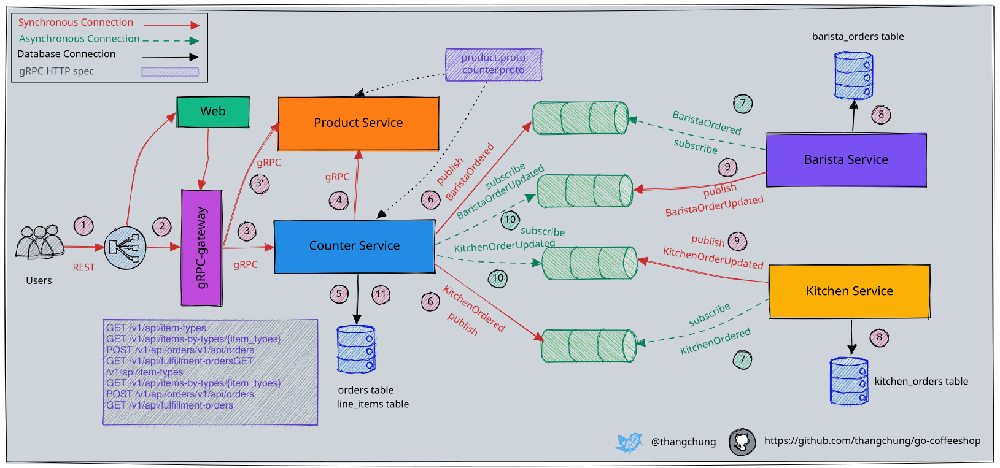
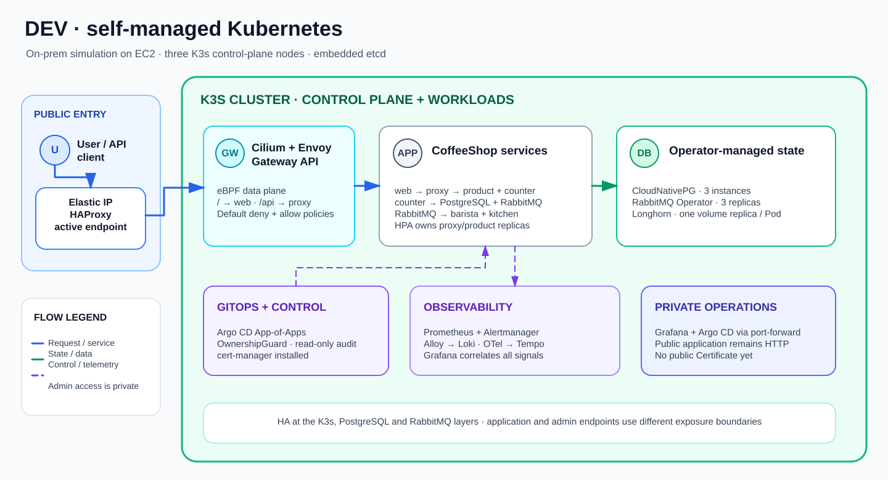
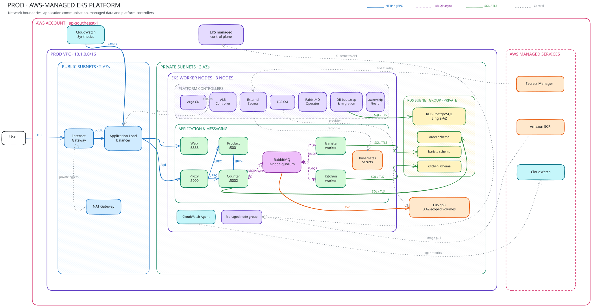
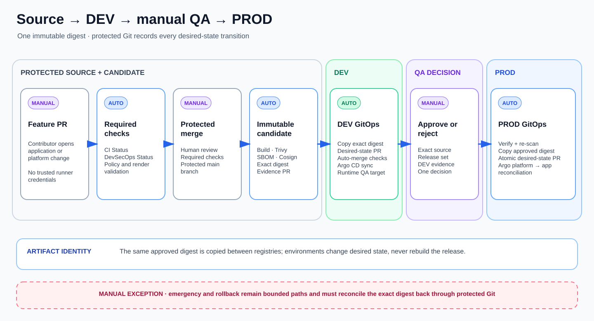

# CoffeeShop Platform

[](https://github.com/T2Dzung/coffee-shop/actions/workflows/ci-app.yml)
[](https://github.com/T2Dzung/coffee-shop/actions/workflows/ci-platform.yml)

CoffeeShop Platform packages an event-driven Go microservices application with
reproducible Kubernetes infrastructure, GitOps delivery and day-two operational
automation. It includes two reproducible portfolio environment profiles:

- a self-managed, on-premises-style platform built with K3s on EC2;
- an AWS-managed platform built with Amazon EKS and RDS PostgreSQL.

> [!NOTE]
> The CoffeeShop application was originally created by
> [Thang Chung](https://github.com/thangchung/go-coffeeshop). This repository extends it
> with Kubernetes, AWS, GitOps, CI/CD, observability and platform-operations code. See
> [Application provenance](docs/application.md#project-provenance).

## Run the application locally

With Docker Compose installed, start the application without provisioning Kubernetes or
AWS infrastructure:

```bash
make docker-compose
```

Open <http://localhost:8888>. The [application guide](docs/application.md) explains the
service flow, local endpoints and screenshots.

## Architecture

### Application flow

The shared workload uses gRPC for synchronous calls and RabbitMQ events to coordinate
the counter, barista and kitchen services.



This application diagram is retained from the upstream project. The infrastructure
around it is provided by CoffeeShop Platform:

### DEV architecture



DEV models a self-managed platform. A public Elastic IP fronts HAProxy; traffic then
enters the three-control-plane K3s cluster through Cilium Gateway API. Cilium also owns
the eBPF data plane and network policy. PostgreSQL, RabbitMQ, storage and the
self-managed metrics/logs/traces stack run inside the cluster.

### PROD architecture



PROD moves the cloud-appropriate boundaries to AWS. An internet-facing ALB sends
traffic directly to EKS Pod IPs. Application data lives in private encrypted RDS,
secrets come from Secrets Manager through External Secrets, and RabbitMQ remains a
three-node operator-managed workload backed by EBS.

The [architecture guide](docs/architecture.md) explains every request, data, operator,
telemetry and GitOps path shown in these diagrams. The [platform layout](docs/platform-layout.md)
maps those responsibilities to their source directories.

### Runtime access

Runtime hostnames are provisioned dynamically and are not committed to the repository.

| Surface | Access contract |
| --- | --- |
| DEV application | `http://$(terraform -chdir=infrastructure/terraform/envs/dev output -raw active_api_endpoint)/` |
| DEV API | Same host under `/api` |
| PROD application | Resolve the ALB hostname with `kubectl get ingress coffeeshop-prod-alb-ingress -n coffeeshop -o jsonpath='{.status.loadBalancer.ingress[0].hostname}'` |
| PROD API | Same ALB host under `/api` |
| Argo CD | Private administrative UI: `kubectl port-forward -n argocd svc/argocd-server 8080:443`, then open `https://localhost:8080` |
| DEV Grafana | Private observability UI: `kubectl port-forward -n monitoring svc/kube-prometheus-stack-grafana 3000:80`, then open `http://localhost:3000` |

Select the DEV or PROD kubeconfig before using a cluster-local administrative command.
Grafana, Prometheus, Alertmanager, Loki, Tempo and Argo CD intentionally have no public
Ingress in the current source.

## Runtime and execution profiles

| Profile | Kubernetes and networking | Data and platform services |
| --- | --- | --- |
| **DEV** | Three-control-plane K3s on EC2, Cilium eBPF, Gateway API and default-deny policies | Longhorn, CloudNativePG, RabbitMQ Operator, Argo CD, Prometheus, Grafana, Loki, Tempo, OpenTelemetry and HPA |
| **CI** | Dedicated single-node K3s on EC2 with Actions Runner Controller (ARC) | Ephemeral `trusted-build` runners for post-merge image build, scan, SBOM and signing; no application data |
| **PROD** | Amazon EKS managed nodes in private subnets with ALB ingress | Private encrypted RDS PostgreSQL, EBS CSI, Secrets Manager through External Secrets, RabbitMQ Operator, Argo CD and CloudWatch |

DEV is not a reduced copy of PROD. It owns the cluster, networking, storage and
observability stack to model self-managed operations. PROD replaces suitable components
with AWS-managed services while keeping the same application and GitOps boundaries.
CI is a separate execution plane, not a third application environment: GitHub-hosted
runners validate untrusted pull requests and run delivery control jobs, while ARC
provides isolated self-hosted capacity only for trusted post-merge candidate builds.

## Operate the platform

[`scripts/platformctl.sh`](scripts/platformctl.sh) is the supported operator entrypoint.
It builds and caches the typed `platformctl` CLI, then exposes a consistent interface
over Terraform, Ansible, AWS CLI, kubectl, GitHub and policy checks. The CLI coordinates
their order, approval, timeout, cleanup and structured output; it is not part of the
runtime architecture.

### 1. Prepare the operator configuration

Install the versions declared in [`platform/toolchain.yaml`](platform/toolchain.yaml),
configure the required AWS profiles and copy the example configuration:

```bash
git clone https://github.com/T2Dzung/coffee-shop.git
cd coffee-shop

mkdir -p ~/.config/go-coffeeshop
cp platform/operator-config.example.yaml ~/.config/go-coffeeshop/operator.yaml
```

Review the selected environment's Terraform variables and update the local operator
config with your AWS profiles, SSH keys, kubeconfig paths and credential-file paths.
Credentials stay outside this repository.

### 2. Check local prerequisites

```bash
bash scripts/platformctl.sh config doctor --environment dev
bash scripts/platformctl.sh validate --profile dev
```

Use `prod` or `all` when preparing another profile. The doctor checks local
configuration and private files; validation checks the tracked infrastructure and policy
contracts.

### 3. Create the environment infrastructure

The first repository bootstrap needs AWS role ARNs and Regions produced by the
environment infrastructure. Create the retained PROD registry and identity resources
first, then bring up CI and DEV:

```bash
# PROD setup creates retained ECR/IAM resources before it waits for a promoted digest.
bash scripts/platformctl.sh prod setup

# Run these from another terminal after the retained PROD resources exist.
bash scripts/platformctl.sh ci setup
bash scripts/platformctl.sh dev setup
```

These commands create billable AWS resources. Review the account, Region and saved
Terraform plan before approving it. The first `prod setup` may wait for a promoted image;
leave it running or resume with `prod reconcile` after the delivery workflow completes.

### 4. Bootstrap GitHub delivery controls

For a new repository, prepare the ignored GitHub Terraform variables from the example,
point the local operator config at mode-`0600` secret files, then reconcile the existing
repository:

```bash
cp infrastructure/terraform/github/terraform.tfvars.example \
   infrastructure/terraform/github/terraform.tfvars

bash scripts/platformctl.sh github bootstrap
bash scripts/platformctl.sh github doctor
```

The bootstrap adopts the repository, creates or imports the five delivery Environments,
reconciles branch rules and Actions variables, and writes encrypted repository secrets
through GitHub CLI without placing their values in Terraform state. Populate the
account-specific role ARNs and Regions from the infrastructure created in the previous
step before running bootstrap.

### 5. Operate or remove capacity

```bash
# Self-managed DEV
bash scripts/platformctl.sh dev setup
bash scripts/platformctl.sh dev status
bash scripts/platformctl.sh dev teardown

# Trusted build plane: EC2 + K3s + ARC
bash scripts/platformctl.sh ci setup
bash scripts/platformctl.sh ci status
bash scripts/platformctl.sh ci teardown

# AWS-managed PROD
bash scripts/platformctl.sh prod setup
bash scripts/platformctl.sh prod status
bash scripts/platformctl.sh prod reconcile
bash scripts/platformctl.sh prod teardown
```

Setup and teardown use one reviewed Terraform saved-plan boundary before mutation. The
[Kubernetes source-of-truth guide](infrastructure/k8s/README.md) explains what Terraform,
Ansible and Argo CD each own.

`ci setup` installs the ARC controller and the `trusted-build` runner scale set;
`ci status` checks the EC2, K3s and ARC boundaries; `ci teardown` removes the billable
runner plane while retaining its remote state. The normal automatic post-merge candidate
flow expects this plane to be online. A deliberate manual fallback can route a candidate
build to `ubuntu-latest`, but that is an operational exception rather than the standard
hybrid-runner path.

## Delivery



The standard release flow keeps one artifact identity from build to production:

1. a developer opens a feature PR; GitHub-hosted application and platform checks run;
2. a human reviews and merges the protected source PR;
3. the post-merge candidate workflow builds changed components on the trusted ARC
   runner, scans them, produces an SBOM and signs each exact digest;
4. candidate-evidence and DEV desired-state PRs auto-merge only after required checks;
5. DEV Argo CD renders the Kustomize overlay and reconciles the exact digest;
6. QA manually records approval or rejection for that source and release set;
7. promotion copies the approved digest, opens one atomic PROD desired-state PR and
   auto-merges it after required checks;
8. PROD Argo CD reconciles the reviewed Kustomize overlay.

The diagram focuses on manual decisions and automatic immutable-digest transitions.
The [architecture guide](docs/architecture.md#delivery-from-source-to-prod) documents
the GitHub-hosted and self-hosted runner boundaries separately.

A separate emergency workflow exists for bounded changes, but it still requires an
immutable digest and reconciliation back to protected source.

## Platform components

| Area | Main components |
| --- | --- |
| Infrastructure | Terraform, Ansible, EC2/K3s, Amazon EKS and environment-scoped remote state |
| GitOps | Argo CD Applications, Kustomize bases/overlays and immutable ECR digests |
| CI/CD | GitHub Actions, ARC, component-aware builds, QA records, promotion and rollback |
| Security | OIDC-based AWS access, private networking, network policies, Trivy, SBOM and Cosign |
| Data | CloudNativePG/Longhorn in DEV; RDS/EBS in PROD; RabbitMQ Operator in both profiles |
| Observability | Prometheus, Grafana, Loki, Tempo and OpenTelemetry in DEV; CloudWatch integrations in PROD |
| Kubernetes operations | HPA, controlled failure rehearsals and [PlatformOwnershipGuard](platform-ownership-guard/README.md) |

## Documentation

- [Documentation index](docs/readme.md)
- [Architecture and environment boundaries](docs/architecture.md)
- [Infrastructure and platform code layout](docs/platform-layout.md)
- [Kubernetes source-of-truth layout](infrastructure/k8s/README.md)
- [PlatformOwnershipGuard](platform-ownership-guard/README.md)

## Roadmap

- Generalize the existing PlatformOwnershipGuard detectors across built-in resources
  and third-party operator CRDs.
- Connect one measured service objective to alerting and a response runbook.
- Rehearse an isolated RDS point-in-time restore.

## License and attribution

The original application remains credited to Thang Chung. See the repository
[MIT license](LICENSE). Platform infrastructure and operational extensions are
maintained by [T2Dzung](https://github.com/T2Dzung).
