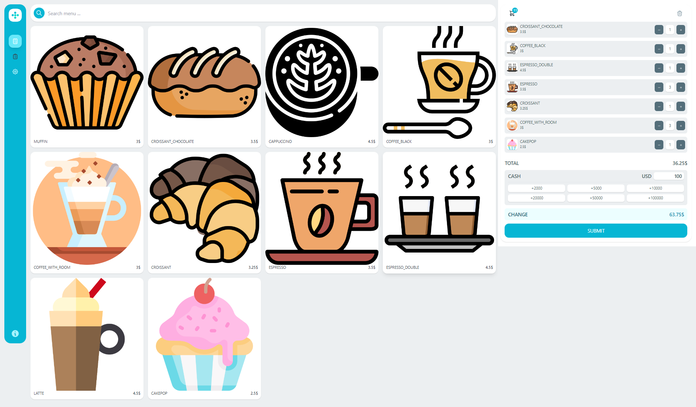
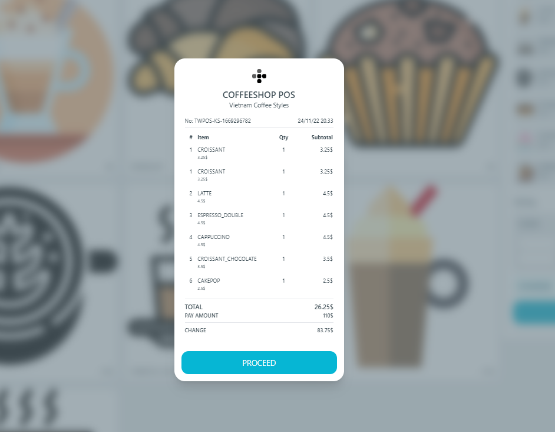
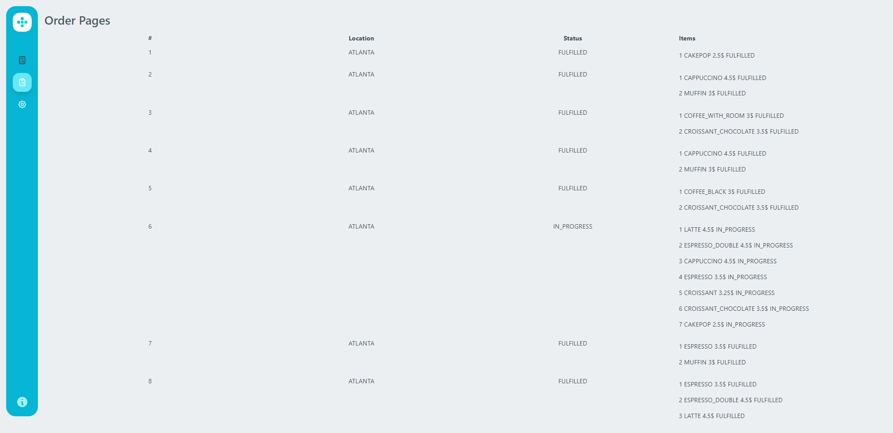
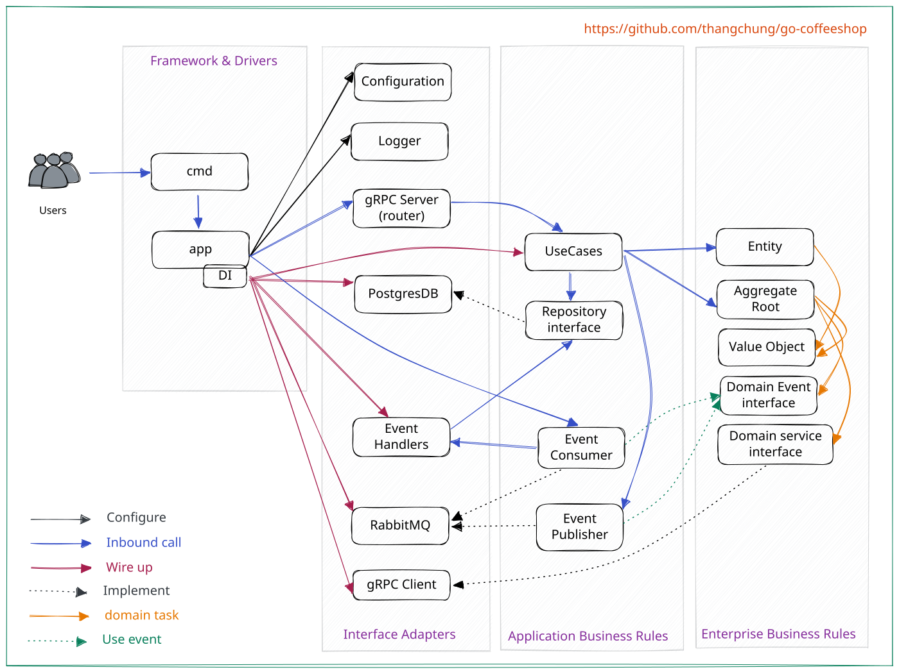

# CoffeeShop application

## Project provenance

The event-driven Go application in this repository was originally created by
[Thang Chung](https://github.com/thangchung/go-coffeeshop). CoffeeShop Platform keeps
that application as the workload while providing a new infrastructure and operations
layer around it.

The application architecture, service implementation, original application diagrams
and screenshots originated upstream. The Kubernetes infrastructure, AWS environments,
delivery automation, operational controls and PlatformOwnershipGuard are extensions
maintained in this repository.

## Application architecture

The application uses synchronous gRPC calls for queries and RabbitMQ events for the
order workflow.


| Service | Local URI | Responsibility |
| --- | --- | --- |
| gRPC gateway / proxy | <http://localhost:5000> | External API boundary |
| Product | <http://localhost:5001> | Product catalogue queries |
| Counter | <http://localhost:5002> | Order acceptance and coordination |
| Barista | Worker only | Drink preparation events |
| Kitchen | Worker only | Food preparation events |
| Web | <http://localhost:8888> | Browser user interface |

### Data ownership boundary

The stateful services use one logical PostgreSQL database in both runtime profiles:
CloudNativePG provides it in DEV and Amazon RDS provides it in PROD. `counter`,
`barista` and `kitchen` write to separate `order`, `barista` and `kitchen` schemas.
`product` keeps its small catalogue in memory, while `proxy` and `web` are stateless.

The three stateful services currently share the non-master `coffeeshop_app` database
role. Schema ownership is therefore an application convention rather than a
database-enforced service security boundary. A future hardening path is to separate the
migration role from schema-scoped runtime roles; separate databases or PostgreSQL
instances would only be justified by independent scaling, fault-isolation or recovery
requirements.

The application stack includes Go, gRPC Gateway, Echo, RabbitMQ, PostgreSQL, sqlc,
golang-migrate and Wire.

## Run locally

Open the repository in its dev container, then run:

```bash
make docker-compose
```

Open <http://localhost:8888> after the services are ready.

Useful upstream development commands:

```bash
make wire
make sqlc
```

The upstream wiki contains additional
[debugging](https://github.com/thangchung/go-coffeeshop/wiki/Golang#debug-app-in-monorepo)
and [troubleshooting](https://github.com/thangchung/go-coffeeshop/wiki#trouble-shooting)
notes.

## Screenshots

### Home



### Payment



### Order list



## Application design



The original application and its retained assets are covered by the repository
[MIT license](../LICENSE).

The upstream HashiCorp deployment diagram is also retained as a
[historical visual reference](img/coffeeshop_hashicorp.svg). CoffeeShop Platform does not use
that Nomad/Consul/Vault runtime; the current infrastructure is documented in the
[platform architecture](architecture.md).
